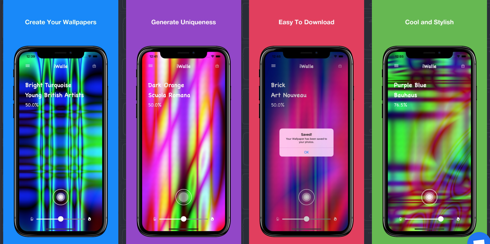
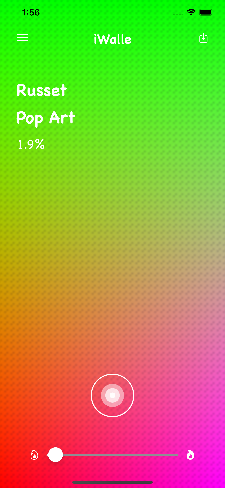

# iWalle

This app generates wallpapers using math operations like multiplication, cos, sin, and average.
I also experimented with other math operations like tan and division, but cos, sin and average
are the operations where I get the best results.
The name of the app is called iWalle. The canvas has a slider that represents the complexity of the 
wallpaper and a save button in the top right corner that saves the generated wallpaper to the user's
photo library. 

## Simple Wallpapers:

## More Complex Wallpapers:

This project attempts to resemble the MVC architectural pattern where the folder called 
`ViewControllers` is the controller, the `DataStructures` folder is the model, and the `StoryBoards`
folder is the view. The `MathBinaryTree` in the `DataStructures` folder is where the random math 
expressions are generated and evaluated. The `CanvasV` in the `ViewControllers` folder is where 
the wallpaper is drawn. 

## Rules to Contribute in the project:
* No changes should be committed directly to the master without approval. At least one person 
 has to approve each pull request before committing to the master.
* We will be using pull requests and code reviews.
* Let's be polite and respectful when writing code reviews.

## Some wallpapers generated:

 
